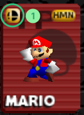
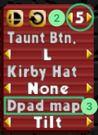

# Netplay Setup

[:fontawesome-brands-youtube: Video Guide by Maafia](https://www.youtube.com/watch?v=l78N0rqMRac){ class="md-button md-button--primary" target="_blank" rel="noopener" data-md-color-primary="red" data-md-color-accent="red" }

## 1. Patching the ROM

Smash Remix is a **ROM hack**, meaning you must apply the Remix data to the base game.

1.  Open the [web patcher](../patcher/index.md).
2.  **Version:** Select the desired Smash Remix version. Default is latest release.
3.  **ROM File:** Select your original Smash 64 ROM.
4.  Click **Apply patch** and save the new `.z64` file.

## 2. Emulator Installation
1.  Download the latest version of [ RMG-K](https://github.com/Jay-Day/RMG-K/releases/latest).
    - **Linux/Mac:** use the Windows version via `wine`, as native netplay support currently isn't available for these platforms.
2.  Extract the package, run the program and click **Select ROM Directory**.
3.  Point the emulator to the folder where you saved your patched ROM.

## 3. Controller Configuration

=== "Modern Controller"

    Modern USB/Wireless controllers (Xbox/PS/Switch/etc.) work with the `Generic USB Input` input plugin (selected by default).

    Controls are configurable via the **Input** button.

=== "N64 Controller"

    N64 controllers connected to a [Raphnet N64 to USB adapter](https://www.raphnet-tech.com/products/n64_usb_adapter_gen3/index.php) work with the `Raphnetraw N64 Adapter` input plugin. No configuration required.

    If you have a different N64 to USB adapter, you'll have to use the `Generic USB Input` input plugin and configure your controls manually via the **Input** button.

=== "GameCube Controller"

    GameCube controllers connected to a GC to USB adapter (Lossless/Nintendo/Mayflash) work with the `GameCube Adapter` input plugin.

    If your adapter has different modes available, make sure it's set to **Switch** or **Wii U** mode, otherwise the input plugin won't detect it.

    Controls are configurable via the **Input** button.

=== "Keyboard"

    Keyboards work with the `Generic USB Input` input plugin (selected by default).

    Controls are configurable via the **Input** button.

??? info "Using the Right Stick for Smash Attacks or Tilt Attacks"
    If you want to use the right stick for smash or tilt attacks,
    map the **N64 D-Pad** to your controller's **Right Stick**.
    Then, when selecting characters in-game, set the desired
    **Dpad Map** option.

    
    

## 4. Online Play (Netplay)

### How to Connect

1.  Click the **Netplay** button.
2.  Set your **Username** at the top of the netplay window.
3.  Click on **Live Server List** for a complete list of available servers. The `ping` column indicates the connection latency between you and the server.
4.  **To Host:** Once connected to a server, press the `Create` button (or right-click on the lobby list) and select the game to host a lobby for.

### Tips

- **Desyncs:** If a game desyncs, the host should hit the **Drop** button and **Start** again to restart the game. There's no need to create a new room.
- **Chat:** Messages appear as an overlay in the game window, even in Fullscreen. Pressing `Enter` will open a text box for typing.

## 5. Other tips

- **Fullscreen mode:** Use `Alt + Enter`
- **Updates:** Automatic update notifications are enabled by default, though you can check for updates manually via `Help > Check for Updates`
- **Volume:** You can adjust the volume in `Settings > Audio`